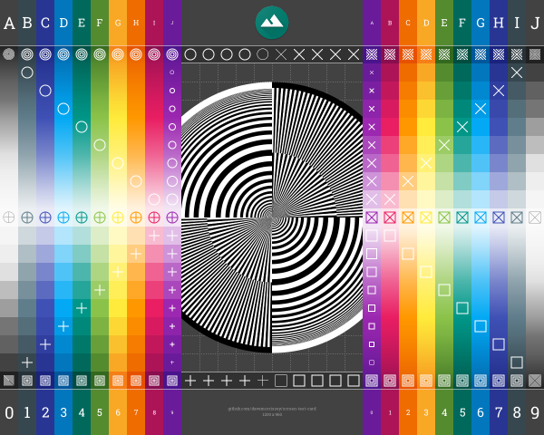

Screen Test Card
================

This simple Scala script generates a screen test card with color palettes (from Material design guidelines),
gradients, and a variety of shapes and patterns with varying stroke widths.

The image is used as a test for the [subsampling-scale-image-view](https://github.com/davemorrissey/subsampling-scale-image-view)
library.

#### Preview

#### License

MIT
